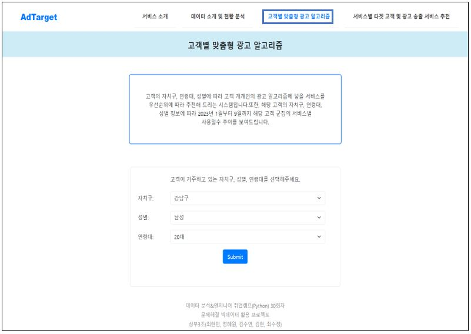

# 💡 Topic

- **통신데이터를 활용한 서비스 패턴 분석 및 광고 추천 시스템**

# 📝 Summary

<p align="center">
  
</p>

|주제|통신데이터를 활용한 서비스 패턴 분석 및 광고 추천 시스템 프로젝트|
|---|---|
|기간|2023.11.14 ~ 2023.12.04 (3주)|
|인원|5명|
|대상|특정 지역에 광고를 진행하고자 하는 광고주들과 각 분야에서 어떤 지역을 타겟으로 광고를 진행할지 고민하는 광고주|
|기획의도|고객 맞춤형 광고 전략을 개발하여, 고객의 지역, 연령, 성별 등 다양한 요인을 고려하여 광고를 타겟팅하고, 서비스 우선순위를 분석하여 **효율적인 예산 투입** 시기와 서비스를 식별하며, 상위 타겟 고객에게 예산을 집중적으로 투입하여 **광고 효율을 극대화**하고, 세분화된 광고를 특정 서비스에서 송출하여 **광고 효과를 최적화**하는 것|

### <개요>
1. 서울시 공공 통신데이터를 활용하여 자치구별로 연령과 성별을 구분하여 현황을 분석
2. Bar plot, map을 통하여 현황 분석 시각화를 진행하고, heatmap을 이용하여 7개의 서비스별 (게임, 금융, 쇼핑, 동영상/방송, 유튜브, 넷플릭스,배달 서비스) 상관관계를 확인
3. 고객별 맞춤형 광고 알고리즘과 서비스별 타겟 고객 및 광고 추천 시스템을 개발
4. 개발한 추천 시스템을 Django 웹 서비스로 구현


# ⭐️ Key Function

- 자치구 연령대별 인구 총합 그래프, 자치구 연령대별 남성,여성 인구 총합 그래프, 서비스별 상관관계 히트맵, 자치구별 평균연령 지도 시각화 등으로 **`현황 분석 결과 제공`**
- **고객별 맞춤형 광고 알고리즘 서비스**
  - 고객이 거주하는 자치구, 연령대, 성별 정보를 선택하면 광고 알고리즘에 보일 서비스를 **`우선순위`** 에 따라 추천해주는 서비스
  - 2023년 1월부터 9월까지 해당 고객 군집의 서비스별 **`사용일수 추이 그래프 시각화 제공`**
- **서비스별 타겟 고객 및 광고 송출 서비스 추천**
  - 게임, 금융, 쇼핑, 동영상/방송, 유튜브, 넷플릭스, 배달 서비스의 7개의 서비스 중 선택한 서비스에 대해 해당 서비스의 이용수가 가장 많은 타겟 고객의 자치구, 연령대, 성별을 우선순위 순으로 정렬하여 타겟 고객별로 선택한 서비스와 **`상관관계가 높은 순`** 으로 **`맞춤형 광고 송출 대상 서비스를 추천`** 하는 서비스


# 🛠 Tech Stack 


`Excel`, `Jupyter notebook`, `VScode`, `Python`,`HTML`, `CSS`,`JSON`,`Numpy`,`Pandas`,`Matplotlib`, `Seaborn`, `Folium`, `Django`


# 📷 Screenshot

### 프로젝트 구조

```
├── README.md
├── .gitignore
│
└── Recommendation_System
        ├── manage.py
        ├── .gitignore
        ├── Recommendation_System
        │     ├── __init__.py
        │     ├── asgi.py
        │     ├── settings.py
        │     ├── urls.py
        │     └── wsgi.py
        ├── recommend
        │     ├── migrations
        │     ├── __init__.py
        │     ├── admin.py
        │     ├── apps.py
        │     ├── forms.py
        │     ├── models.py
        │     ├── tests.py
        │     ├── urls.py
        │     └── views.py
        ├── templates
        │     ├── data.html
        │     ├── index.html
        │     ├── service.html
        │     ├── service1.html
        │     └── service2.html
        └── static
              ├── css
              ├── image
              └── js
        
```


  





# 🤚🏻 Part

**팀 프로젝트(문제해결 빅데이터 활용 프로젝트)**
- 데이터 전처리
- 현황분석 및 시각화
- 추천 시스템 서비스 구현
- Django 웹 서비스 구현

# 🤔 Learned

- Python을 활용한 데이터 분석 기법을 익히는 과정에서, **`데이터 분석`** 능력 및 **`Python`** 활용 능력 강화
- **`데이터 전처리`** 과정에서 단위 통일, 데이터 구분 및 가중치 부여 등을 경험하며 데이터 전처리 능력을 향상
- Bar plot, Map, Line graph, Heatmap 등 다양한 **`데이터 시각화`** 도구를 통한 복잡한 데이터를 이해하고 전달하는 능력 향상
- Django 프레임워크의 **`서비스 구현`** 방법을 실제로 활용함으로써 구현 능력 향상
- 추천시스템에 대한 이해를 바탕으로 실제 시스템에 적용하는 방법도 배우며, 이를 통한 **`추천 시스템`** 구현 능력 강화

